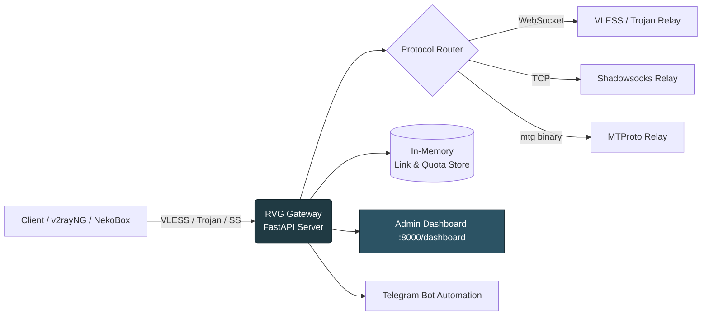
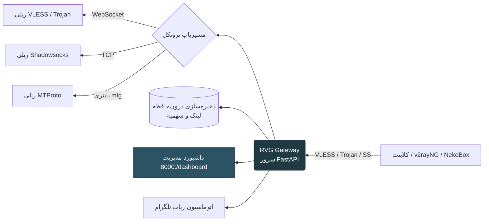

<div align="center">


<a href="#-english"></a>
<a href="#-فارسی"></a>

<br/>


<br/>

[](https://python.org)
[](https://fastapi.tiangolo.com)
[](https://railway.app)
[](./LICENSE)


</div>

<br/>

---

<div align="center">
<h1>🇬🇧 English</h1>
</div>

## 📖 Table of Contents

- [Overview](#-overview)
- [Features](#-features)
- [Supported Protocols](#-supported-protocols)
- [Architecture](#-architecture)
- [Project Structure](#-project-structure)
- [Quick Start (Railway)](#-quick-start-railway-deploy)
- [Local Development](#-local-development)
- [Environment Variables](#-environment-variables)
- [Dashboard Preview](#-dashboard-preview)
- [Roadmap](#-roadmap)
- [Contributing](#-contributing)
- [License](#-license)
- [Support the Project](#-support-the-project)

<br/>

## 🚀 Overview

**RVG Gateway** is a fast, modern, self-hosted **multi-protocol proxy management panel**, built with **Python + FastAPI**, designed to deploy in minutes on **Railway**.

It gives you a beautiful admin dashboard to create, monitor, and manage proxy links across multiple protocols — with per-link traffic quotas, live connection stats, and QR code generation — all from a single lightweight service.

> 💡 Originally built around a simple VLESS-over-WebSocket relay, RVG has evolved into a full multi-protocol gateway with authentication, quota tracking, and a polished management UI.

<br/>

## ✨ Features

<table>
<tr>
<td width="50%">

### 🔌 Core Gateway
- VLESS over WebSocket (TLS 443)
- Trojan, Shadowsocks (AEAD / aes-256-gcm)
- MTProto proxy via `mtg` binary
- Internal HTTP Proxy
- xHTTP / gRPC / HTTPUpgrade transports

</td>
<td width="50%">

### 📊 Management Dashboard
- Real-time traffic charts & trend indicators
- Live connection monitoring
- Unlimited link creation with per-link quotas (MB/GB)
- Instant enable / disable per link
- QR Code export for every link

</td>
</tr>
<tr>
<td width="50%">

### 🛡️ Security & Reliability
- Strict UUID validation
- Session-based authentication
- TLS fingerprint spoofing (Chrome)
- Optimized relay buffers (512KB, `TCP_NODELAY`, `SO_KEEPALIVE`)

</td>
<td width="50%">

### 🤖 Automation
- Telegram-bot-integrated proxy management
- Domain suggestion via Cloudflare Worker
- Automated TCP proxy dispatch with blacklist targeting
- One-click Railway deployment

</td>
</tr>
</table>

<br/>

## 🌐 Supported Protocols

| Protocol | Transport | Status |
|---|---|:---:|
| VLESS | WebSocket / xHTTP / gRPC | ✅ |
| Trojan | WebSocket / HTTPUpgrade | ✅ |
| Shadowsocks | AEAD (aes-256-gcm) | ✅ |
| MTProto | `mtg` v2.1.7 | ✅ |
| HTTP Proxy | Internal | ✅ |

<br/>

## 🏗️ Architecture



<br/>

## 📂 Project Structure

```
RVG/
├── protocol/                 # Per-protocol relay implementations
├── main.py                   # FastAPI app entrypoint
├── central.py                 # Core orchestration logic
├── pages.py                   # Dashboard route/page handlers
├── updater.py                  # Self-update logic
├── botgeneratedomin.py         # Telegram bot: domain generation
├── bottokentcpproxy.py         # TCP proxy automation via Telegram
├── zeussocks5.py                # SOCKS5 proxy handler
├── requirements.txt
├── .gitignore
└── README.md
```

<br/>

## ⚡ Quick Start (Railway Deploy)

<table>
<tr>
<td width="60px" align="center">1️⃣</td>
<td>

**Fork this repository**

```
https://github.com/arvin341az-glitch/RVG/fork
```

</td>
</tr>
<tr>
<td align="center">2️⃣</td>
<td>

**Deploy on Railway**

1. Go to [Railway.app](https://railway.app)
2. Click **New Project → Deploy from GitHub repo**
3. Select your forked repository
4. Railway auto-builds and deploys 🎉

</td>
</tr>
<tr>
<td align="center">3️⃣</td>
<td>

**Enable a public domain**

Railway → Settings → Networking → **Generate Domain**
(this sets `RAILWAY_PUBLIC_DOMAIN` automatically)

</td>
</tr>
<tr>
<td align="center">4️⃣</td>
<td>

**Open your dashboard**

```
https://your-app.up.railway.app/dashboard
```

Copy the default VLESS link and import it into your client (v2rayNG, NekoBox, Streisand, …).

</td>
</tr>
</table>

<br/>

## 💻 Local Development

```bash
# Clone your fork
git clone https://github.com/<your-username>/RVG.git
cd RVG

# Create a virtual environment
python -m venv venv
source venv/bin/activate   # Windows: venv\Scripts\activate

# Install dependencies
pip install -r requirements.txt

# Run the server
python main.py
```

The dashboard will be available at `http://localhost:8000/dashboard`.

<br/>

## ⚙️ Environment Variables

| Variable | Description | Default |
|---|---|---|
| `PORT` | Port the service runs on | `8000` |
| `SECRET_KEY` | Internal security key | Randomly generated |
| `RAILWAY_PUBLIC_DOMAIN` | Public Railway domain (auto-set) | `localhost` |

<br/>

## 📸 Dashboard Preview

<div align="center">

> Traffic overview • Live connections • Link manager • QR export


</div>

<br/>

## 🗺️ Roadmap

- [x] Multi-protocol relay (VLESS, Trojan, Shadowsocks, MTProto)
- [x] Telegram bot automation
- [x] Traffic dashboard with charts
- [ ] Persistent storage (Redis / PostgreSQL)
- [ ] Multi-node / cluster support
- [ ] Public REST API for external integrations

<br/>

## 🤝 Contributing

Pull requests are welcome for bug fixes, optimizations, and documentation.
> ⚠️ Please read the [LICENSE](./LICENSE) before contributing — modification and redistribution of modified versions is restricted. Open an issue first if you'd like to discuss a change.

<br/>

## 📄 License

This project is distributed under a **custom license**:
✅ Free to use, deploy, and fork
❌ Modifying and redistributing a modified version is **not permitted**

See the full [LICENSE](./LICENSE) file for details.

<br/>

## ❤️ Support the Project

If this project helped you, consider supporting its development:

<div align="center">

[]([https://your-donate-link.com](https://railwayx3ui.page.gd/wallet/donate.html))
[]([https://wallets.arvin341az.workers.dev](https://railwayx3ui.page.gd/wallet/donate.html))

**Made with ❤️ by [codebox](https://github.com/arvin341az-glitch)**

</div>

<br/>

---

<br/>

<div align="center" dir="rtl">
<h1>🇮🇷 فارسی</h1>
</div>

## 📖 فهرست مطالب

- [معرفی](#-معرفی)
- [ویژگی‌ها](#-ویژگیها)
- [پروتکل‌های پشتیبانی‌شده](#-پروتکلهای-پشتیبانیشده)
- [معماری](#-معماری)
- [ساختار پروژه](#-ساختار-پروژه)
- [شروع سریع (دیپلوی روی Railway)](#-شروع-سریع-دیپلوی-روی-railway)
- [توسعه محلی](#-توسعه-محلی)
- [متغیرهای محیطی](#-متغیرهای-محیطی)
- [نقشه راه](#-نقشه-راه)
- [مشارکت](#-مشارکت)
- [لایسنس](#-لایسنس)
- [حمایت از پروژه](#-حمایت-از-پروژه)

<br/>

## 🚀 معرفی

**RVG Gateway** یک پنل مدیریت پروکسی چندپروتکلی، سریع و مدرن است که با **Python + FastAPI** ساخته شده و در چند دقیقه روی **Railway** قابل دیپلوی است.

این پروژه یک داشبورد مدیریتی زیبا در اختیارتان می‌گذارد تا لینک‌های پروکسی را در پروتکل‌های مختلف بسازید، مانیتور کنید و مدیریت کنید — همراه با محدودیت ترافیک اختصاصی برای هر لینک، آمار اتصالات زنده و خروجی QR Code، همه از طریق یک سرویس سبک و یکپارچه.

> 💡 این پروژه که ابتدا یک ریلی ساده VLESS روی WebSocket بود، اکنون به یک دروازه کامل چندپروتکلی با احراز هویت، مدیریت سهمیه و رابط کاربری حرفه‌ای تبدیل شده است.

<br/>

## ✨ ویژگی‌ها

<table dir="rtl">
<tr>
<td width="50%">

### 🔌 هسته دروازه
- VLESS روی WebSocket (TLS 443)
- Trojan، Shadowsocks (AEAD / aes-256-gcm)
- پروکسی MTProto از طریق باینری `mtg`
- HTTP Proxy داخلی
- ترنسپورت‌های xHTTP / gRPC / HTTPUpgrade

</td>
<td width="50%">

### 📊 داشبورد مدیریتی
- نمودار ترافیک لحظه‌ای و شاخص‌های روند
- مانیتورینگ اتصالات زنده
- ساخت لینک نامحدود با محدودیت ترافیک اختصاصی (MB/GB)
- فعال/غیرفعال‌سازی آنی هر لینک
- خروجی QR Code برای هر لینک

</td>
</tr>
<tr>
<td width="50%">

### 🛡️ امنیت و پایداری
- اعتبارسنجی دقیق UUID
- احراز هویت مبتنی بر سشن
- جعل فینگرپرینت TLS (Chrome)
- بافرهای بهینه‌شده ریلی (۵۱۲ کیلوبایت، `TCP_NODELAY`، `SO_KEEPALIVE`)

</td>
<td width="50%">

### 🤖 اتوماسیون
- مدیریت پروکسی یکپارچه با ربات تلگرام
- پیشنهاد دامنه از طریق Cloudflare Worker
- ارسال خودکار پروکسی TCP با هدف‌گیری بلک‌لیست
- دیپلوی با یک کلیک روی Railway

</td>
</tr>
</table>

<br/>

## 🌐 پروتکل‌های پشتیبانی‌شده

| پروتکل | ترنسپورت | وضعیت |
|---|---|:---:|
| VLESS | WebSocket / xHTTP / gRPC | ✅ |
| Trojan | WebSocket / HTTPUpgrade | ✅ |
| Shadowsocks | AEAD (aes-256-gcm) | ✅ |
| MTProto | `mtg` v2.1.7 | ✅ |
| HTTP Proxy | داخلی | ✅ |

<br/>

## 🏗️ معماری



<br/>

## 📂 ساختار پروژه

```
RVG/
├── protocol/                 # پیاده‌سازی ریلی هر پروتکل
├── main.py                   # نقطه ورود اپلیکیشن FastAPI
├── central.py                 # منطق اصلی هماهنگ‌سازی
├── pages.py                   # هندلر مسیرها/صفحات داشبورد
├── updater.py                  # منطق به‌روزرسانی خودکار
├── botgeneratedomin.py         # ربات تلگرام: تولید دامنه
├── bottokentcpproxy.py         # اتوماسیون پروکسی TCP از طریق تلگرام
├── zeussocks5.py                # هندلر پروکسی SOCKS5
├── requirements.txt
├── .gitignore
└── README.md
```

<br/>

## ⚡ شروع سریع (دیپلوی روی Railway)

<table dir="rtl">
<tr>
<td width="60px" align="center">1️⃣</td>
<td>

**فورک کردن این ریپازیتوری**

```
https://github.com/arvin341az-glitch/RVG/fork
```

</td>
</tr>
<tr>
<td align="center">2️⃣</td>
<td>

**دیپلوی روی Railway**

۱. وارد [Railway.app](https://railway.app) شوید
۲. روی **New Project → Deploy from GitHub repo** کلیک کنید
۳. ریپازیتوری فورک‌شده خود را انتخاب کنید
۴. Railway به‌صورت خودکار پروژه را می‌سازد و دیپلوی می‌کند 🎉

</td>
</tr>
<tr>
<td align="center">3️⃣</td>
<td>

**فعال‌سازی دامنه عمومی**

Railway ← Settings ← Networking ← **Generate Domain**
(این کار متغیر `RAILWAY_PUBLIC_DOMAIN` را خودکار تنظیم می‌کند)

</td>
</tr>
<tr>
<td align="center">4️⃣</td>
<td>

**باز کردن داشبورد**

```
https://your-app.up.railway.app/dashboard
```

لینک پیش‌فرض VLESS را کپی کرده و در کلاینت دلخواه (v2rayNG، NekoBox، Streisand و...) وارد کنید.

</td>
</tr>
</table>

<br/>

## 💻 توسعه محلی

```bash
# کلون کردن فورک شما
git clone https://github.com/<your-username>/RVG.git
cd RVG

# ساخت محیط مجازی
python -m venv venv
source venv/bin/activate   # ویندوز: venv\Scripts\activate

# نصب وابستگی‌ها
pip install -r requirements.txt

# اجرای سرور
python main.py
```

داشبورد در آدرس `http://localhost:8000/dashboard` در دسترس خواهد بود.

<br/>

## ⚙️ متغیرهای محیطی

| متغیر | توضیح | پیش‌فرض |
|---|---|---|
| `PORT` | پورت اجرای سرویس | `8000` |
| `SECRET_KEY` | کلید امنیتی داخلی | تولید تصادفی |
| `RAILWAY_PUBLIC_DOMAIN` | دامنه عمومی Railway (خودکار) | `localhost` |

<br/>

## 🗺️ نقشه راه

- [x] ریلی چندپروتکلی (VLESS، Trojan، Shadowsocks، MTProto)
- [x] اتوماسیون ربات تلگرام
- [x] داشبورد ترافیک با نمودار
- [ ] ذخیره‌سازی دائمی (Redis / PostgreSQL)
- [ ] پشتیبانی چندنودی / کلاستر
- [ ] API عمومی REST برای یکپارچه‌سازی با سرویس‌های دیگر

<br/>

## 🤝 مشارکت

پول‌ریکوئست برای رفع باگ، بهینه‌سازی و مستندسازی خوش‌آمد است.
> ⚠️ لطفاً قبل از مشارکت، فایل [LICENSE](./LICENSE) را مطالعه کنید — تغییر و بازنشر نسخه تغییریافته محدود شده است. برای هرگونه تغییر، ابتدا یک Issue باز کنید.

<br/>

## 📄 لایسنس

این پروژه تحت یک **لایسنس سفارشی** منتشر شده است:
✅ استفاده، دیپلوی و فورک آزاد
❌ تغییر و بازنشر نسخه تغییریافته **مجاز نیست**

برای جزئیات کامل به فایل [LICENSE](./LICENSE) مراجعه کنید.

<br/>

## ❤️ حمایت از پروژه

اگر این پروژه به شما کمک کرد، می‌توانید از توسعه آن حمایت کنید:

<div align="center">

[]([https://your-donate-link.com](https://railwayx3ui.page.gd/wallet/donate.html))
[]([https://wallets.arvin341az.workers.dev](https://railwayx3ui.page.gd/wallet/donate.html))

**ساخته‌شده با ❤️ توسط [codebox](https://github.com/arvin341az-glitch)**

</div>

<br/>


